<picture>
  <source media="(prefers-color-scheme: dark)"  srcset="./dark.svg">
  <source media="(prefers-color-scheme: light)" srcset="./light.svg">
  
</picture>

  

---

## About

Final-year PhD student at **Friedrich-Schiller University Jena**, advised by **Dr. Kevin M. Jablonka**. I work on **AI for chemistry and materials science** — with a focus on polymer informatics, multimodal representation learning, and machine-learning workflows for chemical data. I also freelance as a data scientist, building Bayesian active-learning pipelines for formulation design.

---

## Research & Projects

- **ChemFuse** — Contrastive-learning framework that aligns fragmented chemical modalities in a shared embedding space, spanning polymers, molecules, and MOFs (PSMILES, BigSMILES, SMILES, names, spectra, MOFid, pXRD, crystal structures). *Manuscript, 2026.*
- **[PolyBind](https://github.com/lamalab-org/PolyBind)** — Contrastive representation alignment unifying PSMILES, BigSMILES, and polymer names; improves downstream prediction over ECFP and PolyBERT baselines. *NeurIPS 2025 — AI for Accelerated Materials Design.*
- **[PolyMetriX](https://github.com/lamalab-org/PolyMetriX)** — Open-source Python library for polymer-informatics workflows: a modular, scikit-learn-compatible API with RDKit feature generation, automated backbone/side-chain decomposition, and Tg benchmarks. *npj Computational Materials, 2025.*
- **[ChemBench](https://github.com/lamalab-org/chembench)** — Chemistry-specific benchmark for evaluating large language models; contributed and reviewed technical and polymer-chemistry tasks. *Nature Chemistry, 2025.*
- **[PolyStabilis](https://github.com/lamalab-org/PolyStabilis)** — ML models for polymer stability prediction on small experimental datasets.
- **GH-GNN** — Gibbs–Helmholtz graph neural network predicting infinite-dilution activity coefficients of polymer solutions, with OCR-based data pipelines. *J. Phys. Chem. A, 2023.*

---

## Selected Publications

- **Kunchapu, S.**, Mirza, A., Prastalo, G., Jablonka, K. M. (2026). *Improving Models by Combining Multimodal Datasets in the Chemical Sciences.* Preprint — code archived on Zenodo: [10.5281/zenodo.21101919](https://doi.org/10.5281/zenodo.21101919).
- **Kunchapu, S.**, Mirza, A., et al. (2025). *PolyBind: Effectively Combining Datasets Indexed in Different Representations of Polymers.* NeurIPS 2025, AI for Accelerated Materials Design.
- Köhler, T., **Kunchapu, S.**, et al. (2025). *Predicting acetalated dextran nanoparticle features: controlled synthesis, formulation and testing in a high-throughput process.*
- **Kunchapu, S.**, Jablonka, K. M. (2025). *PolyMetriX: an ecosystem for digital polymer chemistry.* npj Computational Materials.
- Mirza, A., Alampara, N., **Kunchapu, S.**, Ríos-García, M., et al. (2025). *A framework for evaluating the chemical knowledge and reasoning abilities of large language models against the expertise of chemists.* Nature Chemistry.
- Sanchez Medina, E. I., **Kunchapu, S.**, Sundmacher, K. (2023). *Gibbs–Helmholtz graph neural network for the prediction of activity coefficients of polymer solutions at infinite dilution.* The Journal of Physical Chemistry A.

---

## Tech

**ML/AI** PyTorch · PyTorch Geometric · PyTorch Lightning · Hugging Face · MLflow · Weights & Biases · Hydra
**Chem-informatics** RDKit
**Data** Pandas · Matplotlib · Seaborn · Tableau
**HPC** SLURM · distributed training
**Deployment** Streamlit · BayBE (Bayesian optimization)

---

<!-- Optional stats cards. Transparent background works in both light & dark. Delete this block if you'd rather not use a third-party service. -->

